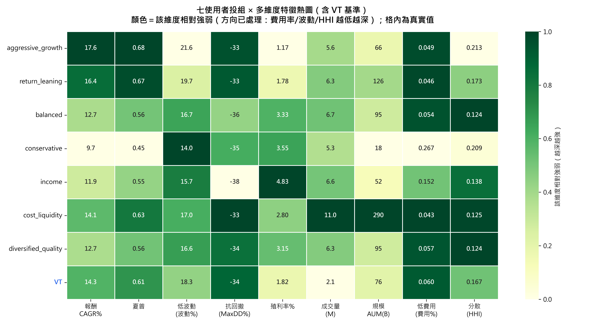

# 七位使用者原型 — 對照分析報告

> 本資料夾 `showcase_7_profiles/` 為**固定展示**：7 個 `USER_PROFILES` 原型各跑一次完整流程
> （主系統推薦 + 季度滾動回測）。每個 `main_<profile>_<時間戳>/` 內含：
> `01_screening_eda/`、`02_portfolio/`（雷達、數學前緣、報表）、以及巢狀的 `backtest_*/`（四分類）。

- **演算法**：生產版 C2（g(w) 三核心 + beta 評分 + noCAGR + 品質約束全關，錨 VT）
- **回測**：季度再平衡，OOS 視窗 **2019-06-01 ~ 2026-06-05（28 期、約 7 年）**，lookback 3 年
- **基準 VT**：CAGR **14.32%**、波動 **18.30%**、Sharpe **0.606**、MaxDD **−33.72%**

---

## 1. 七個使用者的偏好權重（9 維，主導維度標粗）

| profile | 報酬CAGR | 殖利率 | 抗波動 | 抗回撤 | 低成本 | 交易量 | 資產規模 | 產業分散 | 情緒 |
|---|--:|--:|--:|--:|--:|--:|--:|--:|--:|
| aggressive_growth | **0.55** | 0.00 | 0.05 | 0.05 | 0.05 | 0.05 | 0.05 | 0.10 | 0.10 |
| return_leaning | **0.40** | 0.10 | 0.14 | 0.06 | 0.10 | 0.04 | 0.04 | 0.07 | 0.05 |
| balanced | **0.22** | 0.13 | 0.15 | 0.12 | 0.10 | 0.05 | 0.05 | 0.13 | 0.05 |
| conservative | 0.08 | 0.12 | **0.28** | **0.22** | 0.10 | 0.04 | 0.06 | 0.08 | 0.02 |
| income | 0.10 | **0.40** | 0.12 | 0.10 | 0.10 | 0.03 | 0.05 | 0.08 | 0.02 |
| cost_liquidity | 0.18 | 0.10 | 0.12 | 0.08 | **0.22** | 0.12 | 0.10 | 0.06 | 0.02 |
| diversified_quality | 0.15 | 0.10 | 0.12 | 0.10 | 0.08 | 0.04 | 0.06 | **0.20** | **0.15** |

## 2. 偏好 → 參數映射 g(w)（決定核心類型與風險水準）

| profile | T_growth（資本利得渴望） | 核心 core | risk_fraction | τ（傾斜強度） |
|---|--:|:--:|--:|--:|
| aggressive_growth | 0.85 | **beta** | 0.85 | 0.025 |
| return_leaning | 0.67 | **beta** | 0.67 | 0.050 |
| cost_liquidity | 0.47 | market | 0.47 | 0.044 |
| balanced | 0.45 | market | 0.45 | 0.058 |
| diversified_quality | 0.41 | market | 0.41 | 0.045 |
| income | 0.31 | minvar | 0.31 | 0.103 |
| conservative | 0.14 | minvar | 0.14 | 0.052 |

> T_growth 由高到低，核心自動 **beta → market → minvar**；risk_fraction 跟著 T_growth 走；
> income 的 τ 最高（0.103）→ 用偏好傾斜把高股息標的拉進來。**這完全是權重的函數，非查表。**

## 3. ★核心成果★ — OOS 季度回測對照（vs VT）

| profile | 核心 | CAGR % | 波動 % | Sharpe | MaxDD % | 贏 VT 報酬 | 贏 VT Sharpe |
|---|:--:|--:|--:|--:|--:|:--:|:--:|
| aggressive_growth | beta | **17.58** | 21.59 | **0.675** | −33.33 | ✅ | ✅ |
| return_leaning | beta | **16.40** | 19.74 | **0.668** | −33.46 | ✅ | ✅ |
| cost_liquidity | market | 14.12 | 16.96 | **0.630** | −33.08 | ✗ | ✅ |
| diversified_quality | market | 12.67 | 16.55 | 0.564 | −33.97 | ✗ | ✗ |
| balanced | market | 12.71 | 16.71 | 0.563 | −36.13 | ✗ | ✗ |
| income | minvar | 11.94 | 15.68 | 0.545 | −38.45 | ✗ | ✗ |
| conservative | minvar | 9.70 | 14.02 | 0.447 | −35.15 | ✗ | ✗ |
| **VT（基準）** | — | 14.32 | 18.30 | 0.606 | −33.72 | — | — |

## 4. 偏好分數樣本外勝率（事後偏好分數贏過對照組的期數 %，28 期）

| profile | win vs VT | win vs EqualWeight | win vs MaxSharpe |
|---|--:|--:|--:|
| income | **100.0** | 100.0 | 100.0 |
| cost_liquidity | 92.9 | 100.0 | 100.0 |
| aggressive_growth | 75.0 | 100.0 | 92.9 |
| conservative | 75.0 | 100.0 | 92.9 |
| balanced | 67.9 | 100.0 | 100.0 |
| diversified_quality | 57.1 | 100.0 | 100.0 |
| return_leaning | 25.0 | 92.9 | 92.9 |

---

## 5. 多維度實跑特徵對照（各使用者投組 vs VT）

下表為每位使用者**推薦投組（Preference_Driven）於回測期間的真實平均特徵**，補上財務面以外的維度（殖利率、流動性、成本、產業分散），用來檢驗「每個人最重視的維度是否真的被滿足」。
**費用率、產業 HHI 越低越好**（HHI 低＝越分散）；**情緒（FinBERT）因資料量與穩定性不足，依系統假設不納入對照。**

| profile | core | CAGR% | Sharpe | Vol% | MaxDD% | 殖利率% | 成交量(M) | AUM(B) | 費用率% | 產業HHI | win_VT% |
|---|:--:|--:|--:|--:|--:|--:|--:|--:|--:|--:|--:|
| aggressive_growth | beta | **17.58** | 0.675 | 21.59 | −33.33 | 1.17 | 5.6 | 66.5 | 0.049 | 0.213 | 75 |
| return_leaning | beta | **16.40** | 0.668 | 19.74 | −33.46 | 1.78 | 6.3 | 126.2 | 0.046 | 0.173 | 25 |
| balanced | market | 12.71 | 0.563 | 16.71 | −36.13 | 3.33 | 6.7 | 95.4 | 0.054 | **0.124** | 68 |
| conservative | minvar | 9.70 | 0.447 | **14.02** | −35.15 | 3.55 | 5.3 | 18.2 | 0.267 | 0.209 | 75 |
| income | minvar | 11.94 | 0.545 | 15.68 | −38.45 | **4.83** | 6.6 | 52.1 | 0.152 | 0.138 | **100** |
| cost_liquidity | market | 14.12 | 0.630 | 16.96 | −33.08 | 2.80 | **11.0** | **290.3** | **0.043** | 0.125 | 93 |
| diversified_quality | market | 12.67 | 0.564 | 16.55 | −33.97 | 3.15 | 6.3 | 94.6 | 0.057 | **0.124** | 57 |
| **VT（基準）** | — | 14.32 | 0.606 | 18.30 | −33.72 | 1.82 | 2.1 | 76.0 | 0.060 | 0.167 | — |

**每個 profile 都在自己最重視的維度上明顯勝出（招牌被滿足）：**
- **income（殖利率 40%）→ 殖利率 4.83%，全場最高、是 VT(1.82%) 的 2.7 倍。**
- **cost_liquidity（成本+流動性）→ 費用率 0.043% 全場最低、成交量 11.0M 與 AUM 290B 全場最高**（VT 僅 2.1M / 76B）。
- **diversified_quality（產業分散）→ HHI 0.124，與 balanced 並列最分散。**
- **conservative（抗波動/抗回撤）→ 波動 14.02% 全場最低。**
- **aggressive_growth / return_leaning（報酬）→ CAGR 17.58 / 16.40% 全場最高、且贏 VT。**
- balanced → 各維度均衡、無明顯短板。

> 反向也佐證了誠實性：每個 profile 在「自己不在意」的維度上就較弱（例如 aggressive 殖利率僅 1.17%；conservative 費用率偏高 0.267%，因為它把預算讓給防禦與股息）——這正說明系統是**依偏好取捨**，而非全維度通吃。

**視覺化（熱圖）**：上述多維度對照另做成 `多維度特徵熱圖.png`（含 VT 基準）——每列一個使用者、每行一個維度，顏色越深＝該維度相對越強（方向已處理：費用率/波動/HHI 越低越深），格內為真實值。刻意用熱圖而非 7 條疊在一起的雷達線，避免擁擠；可一眼看出**每個使用者都在自己最重視的維度「亮起來」**（income→殖利率、cost_liquidity→成交量/規模/低費用、diversified_quality→分散、conservative→低波動、aggressive/return_leaning→報酬）。

---

## 6. 分析

**(1) 只有 beta 核心（報酬導向）真正贏過 VT 的「絕對報酬」。**
aggressive_growth（17.58%）、return_leaning（16.40%）是 7 人中唯二 CAGR > VT（14.32%）者，且 Sharpe 也 > VT。
代價是更高波動（21.59 / 19.74 vs VT 18.30）。aggressive 比 return_leaning 更高 rf（0.85 vs 0.67）→ 更高波動換更高報酬，**「風險→報酬」階梯乾淨**。這正是 U-C2 存在的理由：報酬導向使用者不是靠「猜哪檔會漲」，而是**承擔更多系統性風險（beta）**。

**(2) market / minvar 核心換來的是「風險效率」與「偏好滿足」，不是絕對報酬。**
balanced / cost_liquidity / diversified_quality / income / conservative 的 CAGR 都 < VT，但波動全部 < VT（14–17% vs 18.3%）。其中 cost_liquidity 的 Sharpe（0.630）甚至高於 VT。conservative 最保守：最低波動（14.02%）、最低 CAGR（9.70%）。**這就是誠實的定位——不是打敗市場報酬，而是更安全、更貼合偏好。**

**(2b) 收入型（income）的偏好確實被滿足 —— 用股息證明。** income 把 40% 偏好放在殖利率。回測中 income 投組的**平均殖利率 4.83%，是 VT（1.82%）的 2.7 倍**，且為 7 策略最高；**累積股息報酬 39.4% vs VT 18.3%**（逾兩倍）。雖然 income 的總報酬/CAGR 低於 VT（它本就不追資本利得），但它**在自己最在意的維度（股息）上大幅勝出**，加上 win_VT 100%、波動更低（15.68% vs 18.3%）→ 偏好被確實滿足。（見各使用者回測夾的 `…_metrics_comparison.png`：「平均殖利率」子圖，以及堆疊「累積總報酬」圖中的金色股息塊。）

> 註：本系統的 **CAGR / 累積總報酬已含股息**（= 資本利得 + 估計現金股息，股息以現金持有、未再投入）；報表另把兩者拆開（`Capital_Gain_Return_%` / `Dividend_Income_Return_%`），故可分別檢視。

**(3) 對「天真基準」幾乎全面壓制。** 7 人對 EqualWeight / MaxSharpe 的偏好勝率幾乎都是 **93–100%**——系統在「滿足使用者偏好」這件事上穩定勝過等權與最大夏普。

**(4) 兩個誠實的張力（不掩飾）：**
- **return_leaning 的 win_VT 偏低（25%）**：它同時要高報酬（40%）又給抗波動 14%，是**自我矛盾的偏好**；其集中型高 beta 投組在 VT 強勢的結構維度（成本/分散/流動性）上失分 → 偏好分數較難贏 VT（但仍以絕對報酬大勝）。
- **部分防禦型 profile 的 MaxDD 反而比 VT 深**（income −38.45%、balanced −36.13%、conservative −35.15% vs VT −33.72%）。這印證系統設計階段的發現：**壓低波動 ≠ 控制回撤**（兩者是不同風險測度）。要真正控回撤，正解是加 MaxDD 約束（列為未來工作）。

**(5) g(w) 行為正確。** T_growth 從 0.85 降到 0.14，核心自動 beta→market→minvar、風險水準同步遞減；income 自動拿到最高 τ 做股息傾斜。整條映射是權重的連續函數，AHP 任意權重與這 7 個手設原型走同一條路。

---

## 7. 結論

跨 7 種使用者，系統行為與設計論述**完全一致且誠實**：
- **報酬導向 → beta 核心 → 穩定贏 VT 絕對報酬**（承擔更多風險換得）。
- **保守 / 收入 / 平衡 / 品質 → market/minvar 核心 → 贏在低波動、風險效率與偏好滿足**，而非絕對報酬。
- **全員對等權 / 最大夏普的偏好勝率 93–100%**。
- 不掩飾的限制：偏好矛盾者（return_leaning）win_VT 低、防禦型 MaxDD 未必優於 VT、單一路徑/視窗。

> 重現方式：`ACTIVE_USER_PROFILE=<profile> python main.py`（7 個 key 見 `parameters.USER_PROFILES`）。
> 數據來源：各 `main_<profile>_*/backtest_*/04_data_csv/backtest_q_summary.csv` 與 `backtest_q_preference_scores.csv`。
